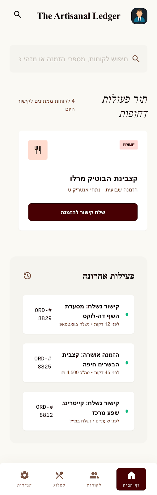
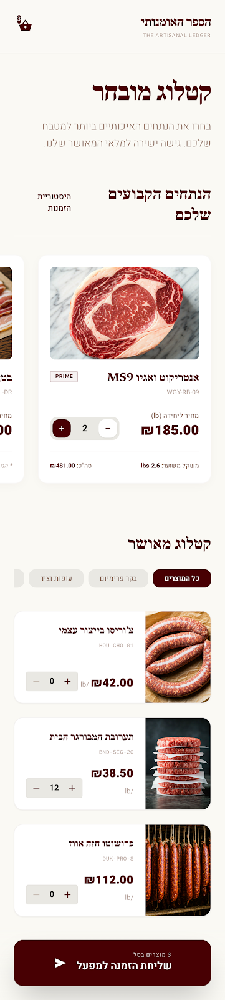
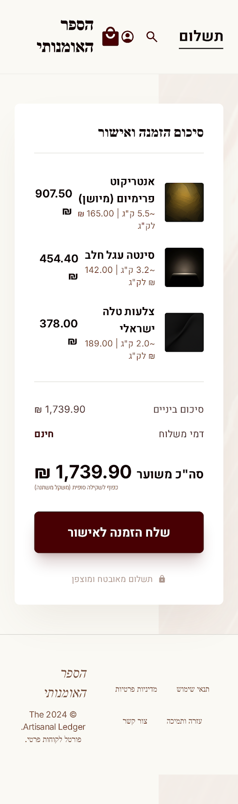
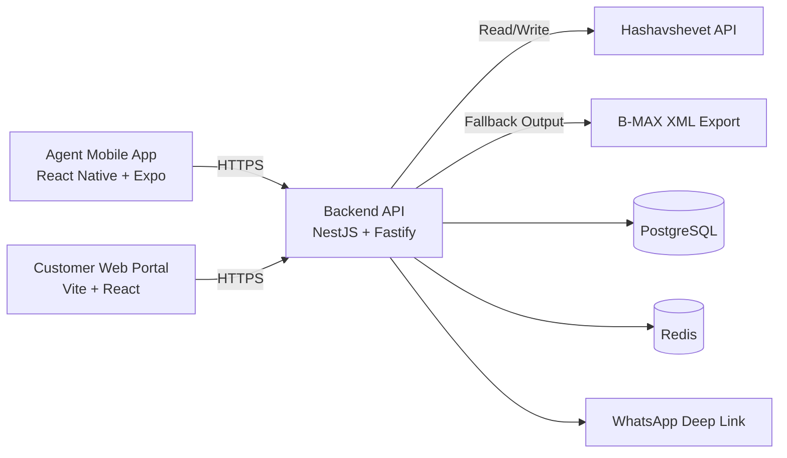

# Awawda Agents — a production platform built by an AI agent squad


> A real B2B ordering platform for a meat factory — **and** an experiment in agentic software engineering. I designed an **autonomous squad of 8 specialized AI agents** (planner, backend, frontend, tester, DevOps, reviewer, logger, monitor), wired them to GitHub Issues, and orchestrated them to ship this full‑stack, production‑grade system end‑to‑end.

**The product:** sales agents manage restaurant/butcher customers from a mobile app and send each a **tokenized magic link**. The customer taps it — no login, no install — sees only their approved items at pre‑negotiated prices, and submits an order that's validated against the live **Hashavshevet** ERP before it commits.

**The interesting part:** I wrote almost none of this by hand. I built the orchestration system that did.

### 🔎 For reviewers (60‑second tour)
- 🤖 **[How this was built →](#-how-this-was-built-an-autonomous-agent-squad)** — the multi‑agent engineering system (the part worth your time)
- 🧠 **[My role →](#-my-role)** — what I designed vs. what the agents produced
- 🏗️ **[Architecture →](docs/Architecture.md)** · 📋 **[Product spec →](docs/PRD.md)**
- 🎬 **Demo video:** _add your Loom/YouTube link here_

---

## Screens

| Agent app — customer dashboard | Customer portal — catalog | Customer portal — checkout |
| :---: | :---: | :---: |
|  |  |  |

_RTL Hebrew UI, mobile‑first, following the in‑house **"Artisanal Ledger"** design system ([`docs/DESIGN.md`](docs/DESIGN.md))._

---

## 🤖 How this was built: an autonomous agent squad

Instead of writing the code directly, I built a **multi‑agent engineering team** — eight role‑specialized agents running on `gpt-5.3-codex`, each with its own charter, coordinated by a lead and gated by an automated reviewer. They pick up GitHub Issues, plan, implement, test, review, and ship.

| Agent | Role | Owns |
| --- | --- | --- |
| **Ripley** | Lead / architect | Scope, sequencing, cross‑cutting review, final decisions |
| **Parker** | Backend dev | NestJS modules, Prisma schema, auth/sessions, ERP integration |
| **Dallas** | Frontend dev | React Native screens, portal pages, forms, UX flows |
| **Lambert** | Tester | Unit/integration/E2E suites, edge cases, regression coverage |
| **Ash** | DevOps | CI/CD, Docker, compose stacks, deployment hardening |
| **Bishop** | Reviewer | Quality gate on Parker/Dallas output — approve, reject, or reassign |
| **Scribe** | Session logger | Background decision/orchestration logs (never blocks) |
| **Ralph** | Work monitor | Circuit breaker — watches for stuck/looping work |

**How the system actually runs:**

- **Issue‑driven routing.** A GitHub Issue labeled `squad` lands in the lead's inbox; the lead triages it and assigns a `squad:{member}` label. A GitHub Action ([`.github/workflows/squad-issue-assign.yml`](.github/workflows/squad-issue-assign.yml)) reads the roster and dispatches the work to that agent. Eleven `squad-*` workflows automate triage, label enforcement, CI, preview, promote, release, and heartbeat.
- **Reviewer gates, not vibes.** Backend and frontend output doesn't merge until **Bishop** approves; everything else is reviewed by **Ripley**. Rejections bounce back with reasons.
- **Ceremonies.** A **design review** auto‑fires *before* any task touching shared systems (agree on interfaces/contracts first); a **retrospective** auto‑fires *after* any build failure, test failure, or reviewer rejection (root‑cause, then action items). See [`.squad/ceremonies.md`](.squad/ceremonies.md).
- **Durable memory.** Architecture decisions ([`.squad/decisions.md`](.squad/decisions.md)) and per‑agent orchestration logs ([`.squad/orchestration-log/`](.squad/orchestration-log/)) give the squad a shared, persistent record across sessions.
- **Parallelism with ownership boundaries.** The routing table ([`.squad/routing.md`](.squad/routing.md)) lets the lead fan out independent work across agents at once while keeping clear domain ownership.

The result is the system documented below: a modular‑monolith backend, two frontends, ERP integration, magic‑link auth, a supervisor control plane, and full test + CI coverage — produced by the squad, steered by me.

---

## 🧠 My role

I was the **orchestrator and architect**, not a bystander:

- **Designed the agent system** — the roster, role charters, routing rules, reviewer gates, and ceremony triggers that make the squad converge instead of thrash.
- **Owned the architecture** — set the Phase‑1 direction (modular monolith, Hashavshevet as single source of truth, magic‑link security model) that the agents executed against; see [`docs/Architecture.md`](docs/Architecture.md).
- **Drove and integrated the work** — wrote and triaged the issue backlog, reviewed agent output, and made the cross‑cutting calls the agents escalated.
- **Took it to production‑grade** — Docker deploy stack, CI/CD gates, EAS mobile build/submit profiles, and a real ERP integration boundary.

This repo is, in effect, two projects in one: a shipped B2B product, and the **agentic harness that shipped it**.

---

## What's in the box

| Component | Path | Stack |
| --- | --- | --- |
| **Agent mobile app** | `apps/agent-mobile` | React Native + Expo, React Navigation, Expo SecureStore, Zod |
| **Customer portal** | `apps/customer-portal` | Vite + React, React Router, RTL (Hebrew) |
| **Backend API** | `apps/api` | NestJS + Fastify, Prisma, PostgreSQL, Redis, Argon2, JWT |
| **Shared contracts** | `packages/shared-types` | TypeScript types + Zod schemas (`/v1` contracts) |
| **Infra** | `infra/` | Docker, Docker Compose (local + deploy stacks) |
| **Agent squad** | `.squad/`, `.github/workflows/squad-*` | Roster, charters, routing, ceremonies, CI automation |

A **modular monolith** backend serves two frontends over HTTPS, talks to Hashavshevet through a swappable ERP gateway, and uses Postgres for operational data (tokens, sessions, orders, audit) and Redis for short‑lived caches.



---

## Core flows

**Agent → customer**

1. Agent logs in (Argon2‑verified, JWT shift token) and sees their assigned customers, pulled live from Hashavshevet.
2. Agent browses the master catalog and adds items to a customer's permanent **Approved Items** allowlist.
3. Agent taps **Generate Link** → backend mints a 32‑byte token, stores only its SHA‑256 hash with a 24h expiry, and the app fires a **WhatsApp deep link** (falls back to copy‑link).

**Customer → order**

1. Customer opens `/m/<token>`; the portal activates the session against `/v1/customer/sessions/activate`.
2. Backend verifies the token hash, status, and expiry, opens a short session, and loads **Recent Items** + **Approved Items** with live pricing.
3. Customer enters weights/quantities and submits with an `idempotency-key`. The backend revalidates every line against current Hashavshevet pricing, commits the order (or B‑MAX XML fallback), and invalidates the link.
4. On a price change the customer gets a precise `409` line‑level mismatch and a refresh‑and‑reconfirm prompt; on an ERP outage, an actionable `503 CUSTOMER_ORDER_ERP_UNAVAILABLE`.

A **supervisor control plane** sits above all of this (`/v1/supervisor/*`): agent roster management, customer assignment/reassignment, forced logout, profile edits, an audit timeline, and a daily oversight snapshot (orders by agent, unassigned customers, ERP retry/failure board, activation funnel).

---

## Getting started

### Prerequisites

- Node.js 20+ and **pnpm 9** (`packageManager` is pinned)
- Docker + Docker Compose (for Postgres/Redis)

### 1. Install

```bash
pnpm install
```

### 2. Start local dependencies (Postgres + Redis)

```bash
pnpm infra:local:up            # local Postgres (127.0.0.1:55432) + Redis
pnpm infra:local:refresh:data  # reset + seed realistic testing-only data
```

### 3. Configure environment

```bash
cp apps/api/.env.example apps/api/.env
cp apps/agent-mobile/.env.example apps/agent-mobile/.env
cp infra/secrets.env.example infra/secrets.env
```

Key API vars: `JWT_SECRET`, `DATABASE_URL`, `REDIS_URL`, `MAGIC_LINK_SIGNING_SECRET`, and the `HASH_*` Hashavshevet credentials. See `apps/api/README.md` for the full list.

### 4. Run the apps

```bash
pnpm api:dev:test                              # API against testing Hash env
pnpm --filter @awawda/customer-portal dev      # customer portal (Vite)
pnpm --filter @awawda/agent-mobile start       # agent app (Expo)
```

The API listens on `http://localhost:3000` by default.

> **Tip:** Login is `POST /v1/agent/auth/login`. A `GET` on that route returns `404` by design. If the Docker deploy stack is running, port `3000` is served by the _containerized_ API + Postgres — seed the DB you're actually calling.

---

## Common scripts

| Command | Does |
| --- | --- |
| `pnpm build` / `pnpm lint` / `pnpm test` | Run across all workspaces |
| `pnpm infra:local:up` / `:down` / `:reset` | Manage local Postgres + Redis |
| `pnpm infra:local:refresh:data` | Reset infra and reseed testing data |
| `pnpm api:dev:test` / `pnpm api:dev:prod` | Run API against testing / production Hash env |
| `pnpm deploy:up` / `:up:test` / `:up:prod` | Bring up the full deploy stack (API + portal + Postgres + Redis) |
| `pnpm deploy:verify:prod` | Fail‑fast production Hash config guardrails |
| `pnpm test:portal-e2e` | Playwright critical‑path E2E for the portal |
| `pnpm test:portal-visual` / `:agent-mobile-visual` | Visual‑regression suites (add `:update` to refresh snapshots) |

Per‑app scripts and the full operational route list live in each app's README (`apps/api/README.md`, `apps/agent-mobile/README.md`, `apps/customer-portal/README.md`).

---

## Security & reliability highlights

- **Magic links:** cryptographically random tokens, hash‑only persistence, `issued → activated → consumed` lifecycle, expiry on submit, rate‑limited activation.
- **Agent auth:** Argon2 password hashing, short‑lived JWT shift tokens, refresh‑token mechanism, per‑agent authorization on every customer operation, supervisor force‑logout.
- **Order integrity:** idempotency keys, pre‑commit price/availability revalidation, structured error codes, never a silent submit on uncertainty.
- **Auditability:** every link, approval, assignment, and order attempt is written to `audit_logs` and surfaced through the supervisor timeline.
- **ERP isolation:** a single `ErpGateway` interface (`HashavshevetApiGateway` primary, `BmaxXmlGateway` fallback) keeps app modules independent of ERP protocol details, with retries and circuit‑breaker behavior on transient upstream failures.

---

## Documentation

| Doc | What it covers |
| --- | --- |
| [`docs/PRD.md`](docs/PRD.md) | Product requirements, personas, functional spec |
| [`docs/Architecture.md`](docs/Architecture.md) | System architecture, domain model, API design |
| [`docs/DESIGN.md`](docs/DESIGN.md) | The "Artisanal Ledger" design system |
| [`docs/hashavshevet-isolation-and-supervisor-control-plane.md`](docs/hashavshevet-isolation-and-supervisor-control-plane.md) | ERP isolation + supervisor plane |
| [`docs/testing-critical-paths.md`](docs/testing-critical-paths.md) | Critical‑path test coverage |
| [`docs/ci-cd-release-gates.md`](docs/ci-cd-release-gates.md) | CI/CD release gates |
| [`docs/mobile-store-release-readiness.md`](docs/mobile-store-release-readiness.md) | iOS + Android store readiness checklist |

---

## Project status

Phase 1 (MVP → hardening): agent app, customer portal, magic‑link ordering, supervisor control plane, and synchronous ERP submission are implemented and tested. Mobile EAS build/submit profiles exist; final store assets and credentials are the remaining gate to store submission.

Private monorepo (`pnpm` workspaces). Built and orchestrated by [@devCana](https://github.com/devCana).
