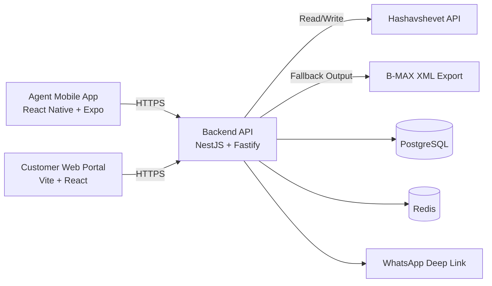

# Awawda Agents

> A digital ordering platform for a B2B meat factory — replacing manual WhatsApp orders with a frictionless, self‑serve pipeline that writes straight into **Hashavshevet** (the factory's ERP / single source of truth).

Sales agents manage their restaurant and butcher customers from a mobile app, then send each one a **tokenized magic link**. The customer taps the link — no login, no app install — sees only their approved items at their pre‑negotiated prices, and submits an order that is validated against the live ERP before it commits.

---

## Why this exists

The factory's order flow used to live in WhatsApp threads and manual data entry into Hashavshevet. That meant transcription errors, ledger discrepancies, and no audit trail. Awawda Agents turns that into a real pipeline:

- **Hashavshevet stays the source of truth.** Customers, catalogs, and negotiated price lists live in the ERP. The app is a thin read/write layer — it never replicates the ledger, it validates against it.
- **Zero‑friction for customers.** A magic link opens straight into a tailored ordering screen. No passwords, no downloads — built to load fast on 3G/4G from a walk‑in fridge.
- **Safe by construction.** One‑time tokens, short sessions, idempotent submits, and price revalidation before every order is committed.

---

## What's in the box

| Component | Path | Stack |
|---|---|---|
| **Agent mobile app** | `apps/agent-mobile` | React Native + Expo, React Navigation, Expo SecureStore, Zod |
| **Customer portal** | `apps/customer-portal` | Vite + React, React Router, Tailwind‑merge, RTL (Hebrew) |
| **Backend API** | `apps/api` | NestJS + Fastify, Prisma, PostgreSQL, Redis, Argon2, JWT |
| **Shared contracts** | `packages/shared-types` | TypeScript types + Zod schemas (`/v1` contracts) |
| **Infra** | `infra/` | Docker, Docker Compose (local + deploy stacks) |
| **Docs** | `docs/` | PRD, architecture, design system, release gates |

A **modular monolith** backend serves two frontends over HTTPS, talks to Hashavshevet through a swappable ERP gateway, and uses Postgres for operational data (tokens, sessions, orders, audit) and Redis for short‑lived caches.



---

## Core flows

**Agent → customer**
1. Agent logs in (Argon2‑verified, JWT shift token) and sees their assigned customers, pulled live from Hashavshevet.
2. Agent browses the master catalog and adds items to a customer's permanent **Approved Items** allowlist.
3. Agent taps **Generate Link** → backend mints a 32‑byte token, stores only its SHA‑256 hash with a 24h expiry, and the app fires a **WhatsApp deep link** (falls back to copy‑link).

**Customer → order**
1. Customer opens `/m/<token>`; the portal activates the session against `/v1/customer/sessions/activate`.
2. Backend verifies the token hash, status, and expiry, opens a short session, and loads **Recent Items** + **Approved Items** with live pricing.
3. Customer enters weights/quantities and submits with an `idempotency-key`. The backend revalidates every line against current Hashavshevet pricing, commits the order (or B‑MAX XML fallback), and invalidates the link.
4. On a price change the customer gets a precise `409` line‑level mismatch and a refresh‑and‑reconfirm prompt; on an ERP outage, an actionable `503 CUSTOMER_ORDER_ERP_UNAVAILABLE`.

A **supervisor control plane** sits above all of this (`/v1/supervisor/*`): agent roster management, customer assignment/reassignment, forced logout, profile edits, an audit timeline, and a daily oversight snapshot (orders by agent, unassigned customers, ERP retry/failure board, activation funnel).

---

## Getting started

### Prerequisites
- Node.js 20+ and **pnpm 9** (`packageManager` is pinned)
- Docker + Docker Compose (for Postgres/Redis)

### 1. Install
```bash
pnpm install
```

### 2. Start local dependencies (Postgres + Redis)
```bash
pnpm infra:local:up          # bring up local Postgres (127.0.0.1:55432) + Redis
pnpm infra:local:refresh:data  # reset + seed realistic testing-only data
```

### 3. Configure environment
Copy the example env files and fill in secrets:
```bash
cp apps/api/.env.example apps/api/.env
cp apps/agent-mobile/.env.example apps/agent-mobile/.env
cp infra/secrets.env.example infra/secrets.env
```
Key API vars: `JWT_SECRET`, `DATABASE_URL`, `REDIS_URL`, `MAGIC_LINK_SIGNING_SECRET`, and the `HASH_*` Hashavshevet credentials. See `apps/api/README.md` for the full list.

### 4. Run the apps
```bash
pnpm api:dev:test                              # API against testing Hash env
pnpm --filter @awawda/customer-portal dev      # customer portal (Vite)
pnpm --filter @awawda/agent-mobile start       # agent app (Expo)
```

The API listens on `http://localhost:3000` by default. Point the mobile app and portal at it via `EXPO_PUBLIC_API_BASE_URL` / the portal's `runtime-config.js`.

> **Tip:** Login is `POST /v1/agent/auth/login`. A `GET` on that route returns `404` by design. If the Docker deploy stack is running, port `3000` is served by the *containerized* API + Postgres — seed the DB you're actually calling.

---

## Common scripts

| Command | Does |
|---|---|
| `pnpm build` / `pnpm lint` / `pnpm test` | Run across all workspaces |
| `pnpm infra:local:up` / `:down` / `:reset` | Manage local Postgres + Redis |
| `pnpm infra:local:refresh:data` | Reset infra and reseed testing data |
| `pnpm api:dev:test` / `pnpm api:dev:prod` | Run API against testing / production Hash env |
| `pnpm deploy:up` / `:up:test` / `:up:prod` | Bring up the full deploy stack (API + portal + Postgres + Redis) |
| `pnpm deploy:verify:prod` | Fail‑fast production Hash config guardrails |
| `pnpm test:portal-e2e` | Playwright critical‑path E2E for the portal |
| `pnpm test:portal-visual` / `:agent-mobile-visual` | Visual‑regression suites (add `:update` to refresh snapshots) |

Per‑app scripts and the full operational route list live in each app's README (`apps/api/README.md`, `apps/agent-mobile/README.md`, `apps/customer-portal/README.md`).

---

## Security & reliability highlights

- **Magic links:** cryptographically random tokens, hash‑only persistence, `issued → activated → consumed` lifecycle, expiry on submit, rate‑limited activation.
- **Agent auth:** Argon2 password hashing, short‑lived JWT shift tokens, refresh‑token mechanism, per‑agent authorization on every customer operation, supervisor force‑logout.
- **Order integrity:** idempotency keys, pre‑commit price/availability revalidation, structured error codes, never a silent submit on uncertainty.
- **Auditability:** every link, approval, assignment, and order attempt is written to `audit_logs` and surfaced through the supervisor timeline.
- **ERP isolation:** a single `ErpGateway` interface (`HashavshevetApiGateway` primary, `BmaxXmlGateway` fallback) keeps app modules independent of ERP protocol details, with retries and circuit‑breaker behavior on transient upstream failures.

---

## Design language

The UI follows **"The Artisanal Ledger"** design system (`docs/DESIGN.md`) — an editorial, high‑contrast aesthetic rooted in the colors of the trade (deep cures, tanned leather, bone white), with RTL‑first Hebrew layouts, tonal layering instead of borders, and Newsreader + Inter/Heebo typography.

---

## Documentation

| Doc | What it covers |
|---|---|
| [`docs/PRD.md`](docs/PRD.md) | Product requirements, personas, functional spec |
| [`docs/Architecture.md`](docs/Architecture.md) | System architecture, domain model, API design |
| [`docs/DESIGN.md`](docs/DESIGN.md) | The Artisanal Ledger design system |
| [`docs/hashavshevet-isolation-and-supervisor-control-plane.md`](docs/hashavshevet-isolation-and-supervisor-control-plane.md) | ERP isolation + supervisor plane |
| [`docs/testing-critical-paths.md`](docs/testing-critical-paths.md) | Critical‑path test coverage |
| [`docs/ci-cd-release-gates.md`](docs/ci-cd-release-gates.md) | CI/CD release gates |
| [`docs/mobile-store-release-readiness.md`](docs/mobile-store-release-readiness.md) | iOS + Android store readiness checklist |

---

## Project status

Phase 1 (MVP → hardening): agent app, customer portal, magic‑link ordering, supervisor control plane, and synchronous ERP submission are implemented and tested. Mobile EAS build/submit profiles exist; final store assets and credentials are the remaining gate to store submission.

This is a private monorepo (`pnpm` workspaces).
