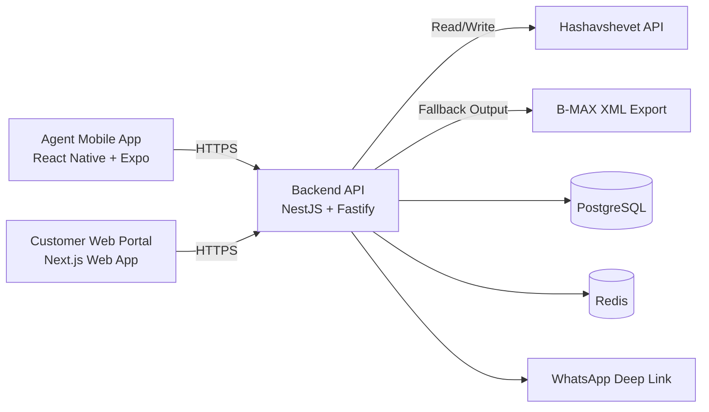

# System Architecture: Factory Agent Mobile App + Customer Ordering Portal

## 1. Purpose

This document defines a practical Phase 1 architecture for the ordering system described in `PRD.md`.

Goals:
- Replace WhatsApp-based manual ordering with a digital flow.
- Keep Hashavshevet as the Single Source of Truth (SSOT).
- Deliver a fast, low-friction customer ordering portal using tokenized magic links.
- Deliver a cross-platform agent app for iOS and Android.
- Keep the architecture simple, modular, and production-ready.

Non-goals for Phase 1:
- Offline order submission.
- Complex recommendation engines.
- Full ERP data replication.
- Multi-ERP support beyond Hashavshevet/B-MAX adapter.

---

## 2. High-Level Architecture



Architecture style:
- Modular monolith backend (single deployable service with clear modules).
- Two frontends:
  - Agent app: cross-platform mobile app (iOS + Android).
  - Customer portal: mobile-first web app.
- Shared contracts/types to avoid API mismatch.

Why this is the right level of complexity:
- One backend service is enough for Phase 1.
- Redis used only for performance and ephemeral session/token caching.
- PostgreSQL stores operational data, audit trails, and idempotency.
- Hashavshevet remains authoritative for customers/items/prices/orders.

---

## 3. Technology Stack (Open Source)

## 3.1 Agent Mobile App (iOS + Android)
- React Native with Expo (TypeScript)
- React Navigation
- TanStack Query (server state)
- Zustand (small local UI state)
- React Hook Form + Zod (forms/validation)
- Expo SecureStore (token storage)
- Expo Linking / `Linking.openURL` (open WhatsApp link)

Reasoning:
- Expo accelerates delivery and supports both iOS/Android from one codebase.
- TanStack Query reduces custom data fetching logic.
- Minimal local state complexity.

## 3.2 Customer Portal (Web)
- Next.js (TypeScript, App Router)
- Tailwind CSS (small, responsive UI)
- TanStack Query
- React Hook Form + Zod

Reasoning:
- Next.js gives fast initial load and straightforward deployment.
- Small, mobile-first pages for weak networks.

## 3.3 Backend API
- NestJS (TypeScript)
- Fastify adapter (better performance)
- Prisma ORM
- PostgreSQL
- Redis
- Pino logger
- Zod for request/response boundary validation where needed

Reasoning:
- Clear module structure with low operational overhead.
- Strong typing end-to-end.
- Fastify + Redis supports responsive customer experience.

## 3.4 Integration Layer
- Hashavshevet REST/SOAP client adapter (depending on available API)
- XML builder for B-MAX fallback output
- Retry with exponential backoff for transient upstream errors

## 3.5 Infra & DevOps
- Monorepo with `pnpm` workspaces
- Docker + Docker Compose for local development
- CI via GitHub Actions (lint, test, build)
- Deploy backend + portal to any container-friendly platform (Render/Fly.io/AWS/GCP/Azure)

---

## 4. Proposed Monorepo Structure

```text
meatland-agents/
  apps/
    agent-mobile/           # React Native Expo app
    customer-portal/        # Next.js app
    api/                    # NestJS backend
  packages/
    shared-types/           # Shared TS types + zod schemas
    ui-tokens/              # Optional shared design tokens (if needed)
  infra/
    docker/
    compose/
  docs/
    PRD.md
    Archeticture.md
```

Keep only `shared-types` in Phase 1 if you want minimal shared packages.

---

## 5. Core Domain Model

SSOT note:
- Hashavshevet is authoritative for customer profile, item master, and negotiated pricing.
- Local DB stores app-operational records (tokens, sessions, audit logs, app metadata, idempotency).

## 5.1 Entities (Local DB)

### `agents`
- `id` (uuid)
- `name`
- `phone`
- `email` (optional)
- `password_hash` (argon2)
- `is_active`
- `created_at`, `updated_at`

### `agent_customer_assignments`
- `id` (uuid)
- `agent_id`
- `hash_customer_id`
- `created_at`

### `customer_approved_items`
- `id` (uuid)
- `hash_customer_id`
- `hash_item_id`
- `added_by_agent_id`
- `created_at`
- Unique: (`hash_customer_id`, `hash_item_id`)

### `magic_links`
- `id` (uuid)
- `token_hash` (sha256)
- `hash_customer_id`
- `issued_by_agent_id`
- `expires_at`
- `status` (`issued`, `activated`, `expired`, `consumed`)
- `activated_at` (nullable)
- `consumed_at` (nullable)
- `created_at`

### `customer_sessions`
- `id` (uuid)
- `magic_link_id`
- `hash_customer_id`
- `session_expires_at`
- `is_active`
- `created_at`

### `orders`
- `id` (uuid)
- `customer_session_id`
- `hash_customer_id`
- `hash_order_ref` (returned by Hashavshevet)
- `status` (`submitted`, `failed`, `pending_retry`)
- `submitted_at`
- `estimated_total`
- `currency`

### `order_lines`
- `id` (uuid)
- `order_id`
- `hash_item_id`
- `item_name_snapshot`
- `quantity`
- `unit`
- `unit_price_snapshot`
- `line_total_snapshot`

### `idempotency_keys`
- `id` (uuid)
- `scope` (`customer_order_submit`)
- `key`
- `response_hash`
- `created_at`
- Unique: (`scope`, `key`)

### `audit_logs`
- `id` (uuid)
- `actor_type` (`agent`, `customer_session`, `system`)
- `actor_id`
- `event_type`
- `event_payload_json`
- `created_at`

---

## 6. Main Functional Flows

## 6.1 Agent: Customer Dashboard
1. Agent logs in.
2. App calls backend `/v1/agent/customers`.
3. Backend validates agent assignment.
4. Backend fetches customer list from Hashavshevet (with short cache).
5. App renders assigned customers.

## 6.2 Agent: Add Approved Item
1. Agent opens a customer profile.
2. App queries master catalog from backend.
3. Agent selects item and taps add.
4. Backend writes approved item mapping (`customer_approved_items`).
5. Entry is now visible under Approved Items in customer portal.

## 6.3 Agent: Generate + Send Magic Link
1. Agent taps Generate Link.
2. Backend creates random token, stores hash in DB, sets 24h expiry.
3. Backend returns full customer URL, example:
   - `https://order.example.com/m/<token>`
4. App opens WhatsApp deep link prefilled with the URL.

## 6.4 Customer: Open Link + Load Portal
1. Customer opens `https://order.example.com/m/<token>`.
2. Portal posts token to `/v1/customer/sessions/activate`.
3. Backend verifies token hash, status, expiry.
4. Backend marks link as `activated`, creates customer session.
5. Backend fetches real-time pricing + approved items + recent items.
6. Portal shows two sections:
   - Recent Items
   - Approved Items

## 6.5 Customer: Submit Order
1. Customer enters weights/quantities.
2. Portal sends payload with `idempotency-key`.
3. Backend revalidates every line against current Hashavshevet pricing/item availability.
4. If valid: backend submits order to Hashavshevet API (or B-MAX XML pipeline).
5. Backend stores order snapshot + response reference.
6. Backend marks related magic link/session as consumed/closed.
7. Portal shows success confirmation.

---

## 7. API Design (Phase 1)

All APIs are versioned: `/v1/...`

## 7.1 Agent APIs

### `POST /v1/agent/auth/login`
- Request: `{ phoneOrEmail, password }`
- Response: `{ accessToken, expiresIn, agentProfile }`

### `GET /v1/agent/customers`
- Returns assigned customers.

### `GET /v1/agent/catalog`
- Returns master catalog from Hashavshevet (cached briefly).

### `GET /v1/agent/customers/:customerId/approved-items`
- Returns approved item list.

### `POST /v1/agent/customers/:customerId/approved-items`
- Request: `{ hashItemId }`
- Adds item to permanent approved list.

### `POST /v1/agent/customers/:customerId/magic-links`
- Request: `{ expiresInHours?: number }` (default 24)
- Response: `{ linkUrl, expiresAt }`

## 7.2 Customer APIs

### `POST /v1/customer/sessions/activate`
- Request: `{ token }`
- Response:
  - `sessionToken`
  - `customer`
  - `recentItems[]`
  - `approvedItems[]`
  - `priceListVersion`
  - `sessionExpiresAt`

### `GET /v1/customer/portal-data`
- Auth: customer session token
- Returns refreshed recent + approved + pricing data.

### `POST /v1/customer/orders`
- Headers: `idempotency-key`
- Auth: customer session token
- Request: order lines
- Response: `{ orderId, hashOrderRef, status }`

### `POST /v1/customer/session/logout`
- Invalidates session.

## 7.3 Internal/Ops APIs

### `GET /v1/health`
- Liveness and basic dependency status.

### `GET /v1/ready`
- Readiness check for DB/Redis/Hashavshevet adapter availability.

---

## 8. Hashavshevet Integration Strategy

## 8.1 Adapter Pattern
Create one internal service interface:

```ts
interface ErpGateway {
  getAssignedCustomers(agentExternalId: string): Promise<Customer[]>;
  getMasterCatalog(): Promise<Item[]>;
  getCustomerPriceList(customerId: string): Promise<PriceLine[]>;
  getRecentItems(customerId: string): Promise<RecentItem[]>;
  submitOrder(payload: ErpOrderPayload): Promise<{ orderRef: string }>;
}
```

Implementations:
- `HashavshevetApiGateway` (primary)
- `BmaxXmlGateway` (fallback mode)

This keeps application modules independent from ERP protocol details.

## 8.2 Validation Before Commit
On order submit, backend must verify:
- Customer exists and is active.
- Submitted items belong to customer approved/recent scope.
- Current ERP prices match submitted prices (or reprice and require client confirmation policy).
- Quantity/weight meets configured constraints.

If mismatch:
- Return `409` with precise line-level mismatch data.
- Portal prompts customer to refresh and re-confirm.

---

## 9. Security Architecture

## 9.1 Tokenized Magic Links
- Generate token with cryptographic randomness (32+ bytes).
- Store only `sha256(token)` in DB.
- Token TTL default: 24h.
- One link maps to one customer.
- Link status lifecycle: `issued -> activated -> consumed`.
- Expire immediately after successful order submission.

## 9.2 Session Security
- Exchange magic token for short-lived customer session token.
- Session token TTL recommended: 2 hours (renewable if link still valid and order not submitted).
- Rate limit activation endpoint.
- IP/user-agent fingerprint logging for abuse visibility.

## 9.3 Agent Auth Security
- Argon2 password hashing.
- JWT access token with short TTL (for example 8h shift).
- Optional refresh token in Phase 2.
- Per-agent authorization checks on every customer operation.

## 9.4 API Hardening
- HTTPS only.
- CORS strict allowlist.
- Helmet-like security headers.
- Request body size limits.
- Input validation with DTO + Zod.
- Idempotency keys on order submission.

## 9.5 Auditability
Log events for:
- Magic link creation/activation/expiration/consumption.
- Approved item changes.
- Order submission attempts and ERP responses.

---

## 10. Performance Architecture

Portal performance targets on 3G/4G:
- First meaningful paint under 2.5s on mid-range device.
- API p95 under 500ms for cached reads.
- Activation flow under 1.2s p95 under normal load.

Tactics:
- Keep portal UI minimal and mobile-first.
- Use server-side rendering for first load where it helps.
- Use Redis cache for short-lived read-through data:
  - master catalog (5-15 min)
  - customer price list snapshot (2-5 min)
  - recent items (2-5 min)
- Compress responses (`gzip`/`brotli`).
- Paginate long catalogs in agent app.

---

## 11. Error Handling & Reliability

Principles:
- Fail safely.
- Return actionable errors.
- Never silently submit uncertain orders.

Patterns:
- Structured error model with stable error codes.
- Retry transient upstream failures (ERP timeout/network) with capped retries.
- Circuit breaker behavior around ERP adapter to avoid request pileups.
- If ERP is temporarily unavailable on submit:
  - Return clear status to user.
  - Optionally queue retry only if business approves asynchronous commit behavior.

Phase 1 recommendation:
- Keep synchronous submission path.
- Show explicit failure if ERP cannot confirm acceptance.

---

## 12. Observability

Minimum for Phase 1:
- Structured JSON logs (Pino).
- Request correlation ID per API call.
- Basic metrics:
  - request latency
  - error rates
  - ERP latency/failure rate
  - magic link activation success rate
  - order submission success rate

Optional (still open-source):
- OpenTelemetry SDK + Prometheus + Grafana dashboards.

---

## 13. Deployment Architecture

## 13.1 Environments
- `dev`
- `staging`
- `prod`

## 13.2 Runtime Components
- `api` service (NestJS)
- `customer-portal` service (Next.js)
- `postgres`
- `redis`

## 13.3 Networking
- API and portal behind HTTPS reverse proxy.
- Private network access for DB/Redis.
- Restrict ERP credentials to backend only.

## 13.4 Secrets Management
Store securely (platform secrets manager):
- `HASH_API_URL`
- `HASH_API_KEY` or auth credentials
- `JWT_SECRET`
- `DB_URL`
- `REDIS_URL`
- `MAGIC_LINK_SIGNING_SECRET`

---

## 14. Mobile App Architecture (Agent App)

## 14.1 Navigation
- Auth stack:
  - Login
- Main stack:
  - Customer List
  - Customer Detail
  - Catalog Picker
  - Link Generation Result

## 14.2 State Layers
- TanStack Query for server data.
- Zustand for UI state (filters, temporary selections).
- SecureStore for auth token.

## 14.3 Core Screens
- Customer Dashboard
- Customer Approved Items
- Master Catalog + add to approved list
- Generate and share WhatsApp link

## 14.4 WhatsApp Dispatch
Use deep link format:
- `whatsapp://send?phone=<customerPhone>&text=<encodedMessage>`
- Fallback to copy link if WhatsApp unavailable.

---

## 15. Customer Portal Architecture

## 15.1 Route Model
- `/m/[token]` for token entry point.
- `/order` for authenticated customer session page.

## 15.2 UI Sections
- Recent Items (from recent deliveries)
- Approved Items (persistent whitelist)
- Cart summary with estimated total

## 15.3 UX Constraints
- Zero-login.
- Large tap targets.
- Minimal typography and low visual weight for weak-network reliability.
- Sticky submit bar for one-hand operation.

---

## 16. Data Contracts (Example)

## 16.1 Order Submit Request

```json
{
  "customerId": "hash-c-123",
  "lines": [
    {
      "itemId": "hash-i-987",
      "quantity": 12.5,
      "unit": "kg",
      "clientUnitPrice": 45.2
    }
  ],
  "notes": "Deliver before 9AM"
}
```

## 16.2 Order Submit Success

```json
{
  "orderId": "f75f2fe9-6d3e-4c42-8c8a-1c9f2c522f62",
  "hashOrderRef": "HSV-2026-004391",
  "status": "submitted"
}
```

## 16.3 Price Mismatch Error (`409`)

```json
{
  "code": "PRICE_MISMATCH",
  "message": "One or more prices changed",
  "lines": [
    {
      "itemId": "hash-i-987",
      "submitted": 45.2,
      "current": 46.0
    }
  ]
}
```

---

## 17. Testing Strategy

## 17.1 Backend
- Unit tests for token lifecycle and validation rules.
- Integration tests for APIs (happy path + failure path).
- Contract tests for ERP adapter mapping.

## 17.2 Mobile App
- Component tests for key screens.
- E2E smoke tests (login, generate link).

## 17.3 Customer Portal
- E2E tests:
  - open link
  - add quantities
  - submit order
  - mismatch handling flow

Recommended tools:
- Vitest/Jest, Supertest, Playwright, React Native Testing Library.

---

## 18. Rollout Plan

## Phase 1A (MVP)
- Agent app login + customer list.
- Approved items management.
- Magic link generation and WhatsApp dispatch.
- Customer portal basic ordering.
- Synchronous ERP submission.

## Phase 1B (Hardening)
- Better observability dashboards.
- Idempotency and retry hardening.
- Performance tuning on real network telemetry.
- Security penetration checks.

---

## 19. Key Decisions Summary

- Cross-platform mobile app: React Native + Expo.
- Customer ordering UX: lightweight Next.js web portal (no app install).
- Backend: NestJS modular monolith with PostgreSQL + Redis.
- ERP integration: Hashavshevet primary, B-MAX XML fallback adapter.
- Security: one-time tokenized magic links, short sessions, post-submit link invalidation.
- Simplicity first: no microservices in Phase 1.

---

## 20. Acceptance Checklist

- Agent can view assigned customers.
- Agent can add approved items per customer.
- Agent can generate and send magic order link via WhatsApp.
- Customer opens link with no login and sees only relevant items.
- Prices come from Hashavshevet at session activation.
- Order submit revalidates against current Hashavshevet state.
- Successful submit invalidates link/session to prevent duplicates.
- Portal and APIs meet mobile performance and security baseline.
